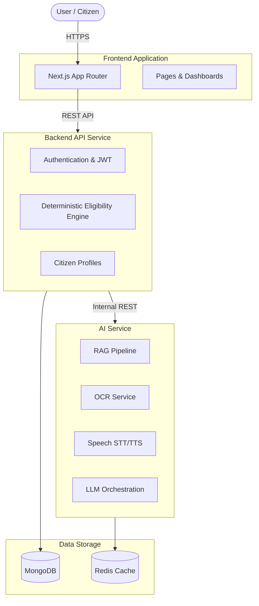

# Revised System Architecture

## Overview
ArogyaSathi has been refactored to cleanly decouple concerns. The system is split into three primary deployment targets:

1. **Frontend**: The user-facing application handling layouts, UI, forms, and client hydration (Next.js).
2. **Backend**: The main API handling authentication, citizen profiles, rule evaluation (deterministic eligibility), and standard CRUD operations (Express + Mongoose).
3. **AI Service**: A dedicated microservice handling purely AI/ML workloads like RAG, LLM orchestration, OCR, STT/TTS (Express API abstraction over Providers).

## Architecture Diagram

## Security & Separation of Concerns
- **AI Service Isolation**: The AI Service is completely segregated from the Backend API, meaning LLM prompts cannot directly mutate the Canonical Citizen Profile Database. The AI Service is treated as a trusted internal worker only exposed to the Backend API.
- **Deterministic Truth**: The Eligibility rule engine executes strictly on standard Backend logic relying on authenticated Citizen Profiles mapped against JSON Scheme Definitions. No LLM controls this branch.
